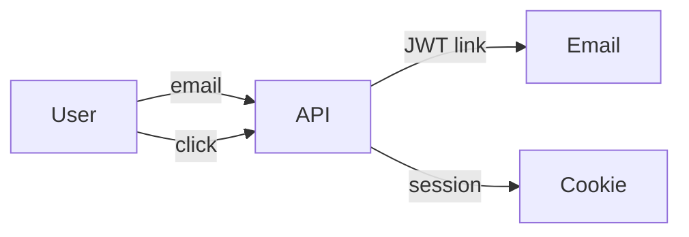

# Writing Visual Plans (Solution Pitches)

A visual plan is a **pitch**, not a punch list. The reader is a human you're convincing. Your job is to sell why your proposed solution is the right one — what problem it solves, what tradeoffs it makes, and at a high level how you'd build it. Implementation details belong in a separate lean plan once the pitch is approved.

Output is a single HTML file in `.claude/plans/<date>-<slug>.html` with semantic color accents, Mermaid diagrams, a font dropdown (Atkinson Hyperlegible / OpenDyslexic / System / Serif), and a scroll-progress indicator. Read-only — reviewer feedback comes back in chat, not via annotations on the file.

## When to use

- User asks for a "pitch", "design doc", "presentation", "visual plan"
- User invokes `/plan-visual`
- You want to propose a solution to a non-trivial problem and show your reasoning
- The work involves architectural decisions or tradeoffs that benefit from being visible to a reviewer

## When NOT to use

- Small one-PR task — use `developer:writing-lean-plans`
- Pitch already approved, you just need to execute — write a lean plan instead
- Pure markdown handoff to a fresh agent — use `superpowers:writing-plans` if installed

## Same rigor, presentation packaging

The pitch only convinces if the work behind it is real. Read the files, trace the call sites, check the schema, verify the numbers you cite. A confident pitch on a wrong premise will get caught — and damage trust on the next one.

- Verify every file path, symbol, and metric before writing.
- If you don't have a metric, say so. "We don't measure this" is more credible than a made-up number.

## Output path

`.claude/plans/YYYY-MM-DD-<slug>.html` — slug lowercase-hyphenated from the title.

## Procedure

1. Verify file paths, symbols, and any data you'll cite.
2. `mkdir -p .claude/plans`
3. `cp <skill-dir>/template.html .claude/plans/<date>-<slug>.html`
4. Use Edit with `replace_all: true` to replace `__TITLE__` (it appears in `<title>`, the toolbar, and `<h1>`).
5. Use Edit to replace `__PLAN_SOURCE__` with the pitch in the dialect below.
6. Tell the user: *"Pitch saved to `.claude/plans/<filename>.html`. Open it in a browser."*

## Dialect

Each section is `## <kind>: <title>`. Body is markdown (parsed by marked.js). Mermaid diagrams embed as ` ```mermaid ` fenced blocks inside any section.

| Kind | Color | Use |
|---|---|---|
| `meta` | (header field) | Compact key/value at the top: goal, audience, status, owner |
| `tldr` | blue (hero) | **One** per pitch. The single most compelling paragraph. |
| `problem` | red | What's broken. State plainly, with data when possible. |
| `solution` | green | What you propose. Lead with the user-visible outcome. |
| `tradeoff` | amber | What this approach costs vs. alternatives. Honest. |
| `milestone` | numbered | One deliverable phase. High-level, not TDD steps. |
| `risk` | orange | Things outside your control or where you're uncertain. Pair with a mitigation when possible. |
| `note` | gray | General callout for context that doesn't fit other kinds. Use sparingly. |

All accent colors are paired with an icon and a text label — color is never the sole signifier.

## Pitch writing rules

- **Lead with the user's reality.** "We're losing 30% of new users at step 2" — not "User onboarding has a problem".
- **Show data or admit you don't have any.** Made-up numbers are worse than honest gaps.
- **One section per idea.** If your problem section has three problems, split them.
- **Make the value visible.** Conversion lift, latency cut, dollars saved, engineer-hours.
- **No code blocks in `tldr` / `problem` / `solution` / `tradeoff` / `risk`.** Code lives in `milestone` when it's load-bearing, or in a separately referenced lean plan.
- **Milestones are deliverable phases, not steps.** "Auth backend ready" is a milestone; "write the test for the token endpoint" is a step (use `superpowers:writing-plans` for that).
- **One or two diagrams, max.** Diagrams are weight-bearing, not decoration.

## Example

````
## meta: goal
Cut new-user drop-off in onboarding.

## meta: audience
Eng leads, Product, Growth

## meta: status
Proposed — pending review

## tldr: Two-tap onboarding using magic-link SSO
We're losing 30% of new users at the email-verification step. Replacing the password flow with magic-link sign-in cuts onboarding from five taps to two and matches the pattern users already know from Notion and Linear.

## problem: 30% drop-off at email verification
Funnel data (Aug–Oct 2026) shows 30% of new users abandon at the verification step. Top support tickets: "didn't get the email" (52%), "link expired" (28%). Password creation drops another 9%.

## solution: Magic-link sign-in via short-lived JWT
User enters email → backend sends a short-lived JWT link → click signs them in. No password, no verification step. Session persists via httpOnly cookie.



## tradeoff: Hard dependency on email delivery
If email delivery breaks, users can't sign in at all. Mitigation: monitor delivery rate, add SMS fallback in a follow-up.

## milestone: Auth backend
Endpoint to generate and email a JWT link, endpoint to validate and create a session. Token storage in Redis with 10-minute TTL.

## milestone: Frontend integration
Replace sign-up and login screens with a single email-entry component. Add the "check your email" interstitial.

## risk: Email-vendor outage
Magic links fail silently if Mailgun degrades. Mitigation: existing health-check + a "didn't receive it?" UI fallback.
````

## Anti-patterns

- "Problem: we need to add SSO" — that's a solution wearing a problem's hat.
- "Solution: maybe SSO if it works" — pitch with conviction or don't pitch.
- Five sections that say the same thing in different colors.
- A diagram of a system you haven't read.
- Mistaking milestones for tasks. (Use `superpowers:writing-plans` for task-level breakdowns.)
- Hiding tradeoffs. The reviewer will notice the gap.
- Decorative use of `note:` to fill space.

## Reviewer experience

Open the file in a browser:
- Title and meta at the top
- TL;DR in a blue-tinted hero card
- Sections with semantic color accents and uppercase badges (PROBLEM, SOLUTION, TRADEOFF, etc.)
- Milestones numbered automatically
- Inline Mermaid diagrams
- Font dropdown (top right) for accessibility
- Scroll-progress bar at the very top

Read-only by design. Feedback comes back to you in chat.

## Edge case — `</script>` in plan content

The plan body lives inside `<script type="text/plan">`. If a code block needs a literal `</script>`, write `<\/script>` instead — the backslash is invisible in rendered markdown but stops the HTML parser from terminating the data block.

## Related skills (no hard dependency)

- **`developer:writing-lean-plans`** — small one-PR tasks, scannable markdown.
- **`superpowers:writing-plans`** — pure markdown TDD plan for handoff to a fresh agent. Use after a pitch is approved.
