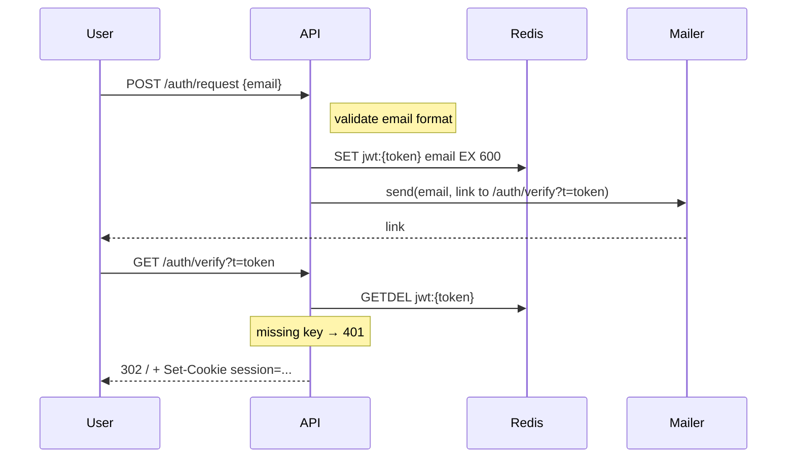

# Writing Visual Plans (Slide Deck)

A visual plan is a **slide deck**, not a pitch. One idea per slide. Diagrams do the explaining — labels on edges, notes on flows, color-coded nodes — so prose stays out of the way. Task slides carry the same iron rules as a full TDD plan: exact files, exact code, exact verify commands. An agent should be able to execute a task slide cold.

Output is a single self-contained HTML file in `.claude/plans/<date>-<slug>.html`. The reader navigates with arrow keys / Space / PgUp / PgDn — one slide at a time — or just scrolls. Read-only.

## When to use

- The change spans multiple files or subsystems and a diagram makes it legible.
- A reviewer needs to understand the design before approving execution.
- User asks for a "slide deck", "design brief", "visual plan".
- User invokes `/plan-visual`.

## When NOT to use

- Small one-PR task with no architectural decisions — `developer:writing-lean-plans`.
- Pure markdown handoff with no diagrams — `superpowers:writing-plans` if installed.
- Every slide would be text-only. Diagrams should carry weight; if they don't, you don't need slides.

## Same rigor

Verify every file path, symbol, schema field, and call site before drawing a diagram or writing a task step. A confident diagram of a system you haven't read will mislead the reviewer and the agent both.

## Output path

`.claude/plans/YYYY-MM-DD-<slug>.html` — slug lowercase-hyphenated.

## Procedure

1. Verify all file paths, symbols, schema fields, and call sites.
2. `mkdir -p .claude/plans`
3. `cp <skill-dir>/template.html .claude/plans/<date>-<slug>.html`
4. Use Edit with `replace_all: true` to replace `__TITLE__` (appears in `<title>`, the toolbar, and the title slide).
5. Use Edit to replace `__PLAN_SOURCE__` with the deck content in the dialect below.
6. Report: *"Deck saved to `.claude/plans/<filename>.html`. Open in a browser — arrow keys navigate slides."*

## Dialect

Sections are `## <kind>: <title>`. Three kinds:

| Kind | Becomes | What goes in the body |
|---|---|---|
| `meta` | Field on the title slide | Plain text (one line). Multiple meta sections merge into one block. |
| `slide` | A content slide | A diagram + at most a short line or short bullet list. Diagram-first. |
| `task` | An executable task slide | Files block + numbered TDD steps + Verify + Commit. Self-contained for an agent. |

Order in source = order in the deck. The title slide is built automatically from the document title + meta sections.

## Diagram-first rule (the headline rule)

**Diagrams carry the explanation. Prose around a diagram is annotation at most — one sentence under the heading, or none.**

Use the right Mermaid diagram type for the job:

- **Flow / sequence of operations** → `sequenceDiagram`. Put the explanation on the messages (`A->>B: validate token + GETDEL`) and use `Note over A,B: ...` for invariants. Wrap regions in `rect rgba(...)` blocks to label phases.
- **Data model change** → `erDiagram`. Annotate fields: `date document_date "NEW - nullable"`. Quoted comments are the explanation.
- **Architecture / surface** → `graph LR` with `classDef new fill:#dcfce7,stroke:#15803d` and tag changed nodes `:::new`. Existing parts get a muted class. Subgraphs label scope.
- **Schedule** → `gantt`. Sections, durations, and dependencies via `:after X`.
- **State machine** → `stateDiagram-v2` with transition labels.

**Avoid:**

- A paragraph of prose that re-states what the diagram already shows.
- Diagrams without labels on edges.
- Diagrams that use color as the only signifier — pair color with text labels.
- More than one diagram per slide (split the slide).

### Worked example — diagram annotates itself

````
## slide: Magic-link sign-in — request and verify


````

That's the whole slide. The diagram is the explanation.

### Worked example — bad

````
## slide: Magic-link sign-in — request and verify

The user enters their email at /signup. Our API validates the format and
generates a 10-minute JWT, storing it in Redis. The Mailer sends a link
to /auth/verify with the token. When the user clicks it, the API looks
up the token, deletes it, and creates a session.

[diagram]
````

The prose duplicates the diagram. Cut the prose.

## Task slide rules (agent-executable)

A task slide must be self-contained — an agent reads the slide and executes it without other context. Every task slide carries:

1. **Files block** — `Create:` / `Modify:` / `Test:` with exact paths. `Modify:` includes line numbers.
2. **Numbered TDD steps:**
   - **Write the failing test** with the full test code.
   - **Run the test, expect FAIL** with the exact command and expected output.
   - **Implement** with the full implementation code.
   - **Run the test, expect PASS** with the exact command.
   - **Commit** with the exact `git commit` command and message.
3. **No placeholders.** No "TBD", "implement later", "similar to task N", "appropriate error handling".
4. **Complete code.** If a step changes code, show the code — full function, full type, full migration.

### Worked example — task slide

````
## task: Auth request endpoint

**Files:**
- Create: `api/handlers/auth_request.py`
- Modify: `api/router.py:40` — register route
- Create: `tests/handlers/test_auth_request.py`

**Step 1: Write failing test**
```python
# tests/handlers/test_auth_request.py
import pytest

@pytest.mark.asyncio
async def test_request_emails_jwt(client, redis_fixture, email_mock):
    r = await client.post("/auth/request", json={"email": "a@b.co"})
    assert r.status_code == 202
    sent = email_mock.last
    assert sent.to == "a@b.co"
    assert "/auth/verify?t=" in sent.body
    token = sent.body.split("t=")[1].strip()
    assert await redis_fixture.get(f"jwt:{token}") == b"a@b.co"
```

**Step 2: Run test, expect FAIL**
`pytest tests/handlers/test_auth_request.py -v`
Expected: FAIL — `404 /auth/request not found`.

**Step 3: Implement handler**
```python
# api/handlers/auth_request.py
import secrets
from fastapi import APIRouter
from pydantic import BaseModel, EmailStr
from ..deps import RedisDep, MailerDep

router = APIRouter()

class AuthRequestIn(BaseModel):
    email: EmailStr

@router.post("/auth/request", status_code=202)
async def auth_request(payload: AuthRequestIn, redis: RedisDep, mailer: MailerDep) -> dict:
    token = secrets.token_urlsafe(24)
    await redis.set(f"jwt:{token}", payload.email, ex=600)
    await mailer.send(payload.email, f"https://app.example.com/auth/verify?t={token}")
    return {"status": "sent"}
```

**Step 4: Register route**
```python
# api/router.py:40
from .handlers import auth_request
app.include_router(auth_request.router)
```

**Step 5: Run test, expect PASS**
`pytest tests/handlers/test_auth_request.py -v`
Expected: PASS.

**Step 6: Commit**
`git commit -am "feat(auth): magic-link request endpoint"`
````

## Information-density rules (no buzz, no marketing)

- **State facts, not interpretation.** "Funnel data Aug–Oct shows 30% drop at /verify" — not "users hate our signup flow".
- **Numbers come from a source you can name.** If you don't have one, omit the number. Don't invent metrics to make the case stronger.
- **No marketing adjectives.** Cut "cleanly", "elegant", "intuitive", "best-in-class", "modern", "seamless", "robust".
- **One sentence under a slide heading, max.** If you need more, you're writing a doc, not a slide. Either trim or split.
- **No emotional framing.** "We're losing users" describes a number; "30% drop at /verify" is the number.

## Reviewer experience

Open the file in a browser:
- Toolbar at top: title, slide counter (`3 / 12`), font dropdown (Atkinson Hyperlegible / OpenDyslexic / System / Serif)
- Title slide: large title + meta block
- Each subsequent slide: heading + diagram or task content, sized to viewport
- Keyboard nav: → / ↓ / Space / PgDn = next, ← / ↑ / PgUp = prev, Home / End = first / last
- Print: one slide per page, page-break-after on every slide

Read-only by design. Feedback comes back in chat.

## Anti-patterns

- Prose paragraph that re-states the diagram.
- Diagrams without edge labels — they don't explain anything.
- Tasks without complete code in each step.
- "Step 1: open the file. Step 2: read it. Step 3: think about it."
- Function or type names mentioned in task 5 that aren't defined in tasks 1–4.
- A task that says "implement X" without showing X.
- Marketing language anywhere.
- More than one diagram on a single slide.
- A slide that's all text — split into bullets or convert to a diagram.

## Edge case — `</script>` in plan content

The plan body lives inside `<script type="text/plan">`. If a code block needs a literal `</script>`, write `<\/script>` instead — the backslash is invisible in rendered markdown but stops the HTML parser from terminating the data block early.

## Related skills (no hard dependency)

- **`developer:writing-lean-plans`** — small one-PR tasks, scannable markdown.
- **`superpowers:writing-plans`** — pure markdown TDD plan for handoff to a fresh agent. Same iron task rules; this skill borrows them.
